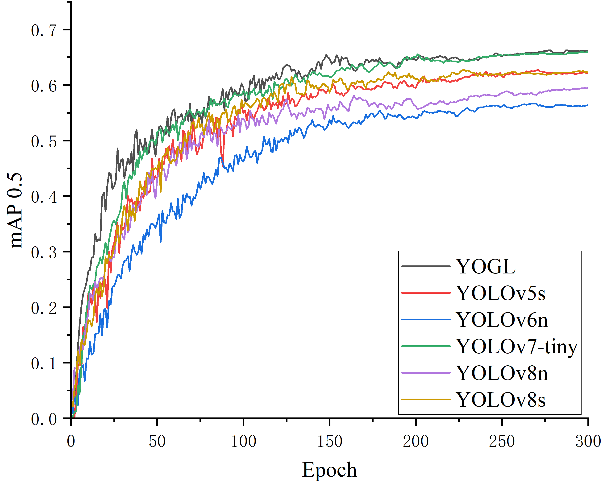

# YOGL: A Lightweight Insulator Defect Detection Network Based on UAV Remote Sensing Images

**Dear reviewers: The source code and pre-trained model weights will be available upon the acceptance of the paper.   Feel free to raise your questions or difficulties in the implementation.**

## YOGL architecture diagram

## LCSA attention mechanism

## Dataset
The full data set will be published later
### Example image of ID-2024

## Experiment

### Comparative Experiments with Mainstream Attention Mechanisms

### Comparison Experiment with Mainstream Lightweight Object Detection Algorithms

### Edge Platform Deployment

