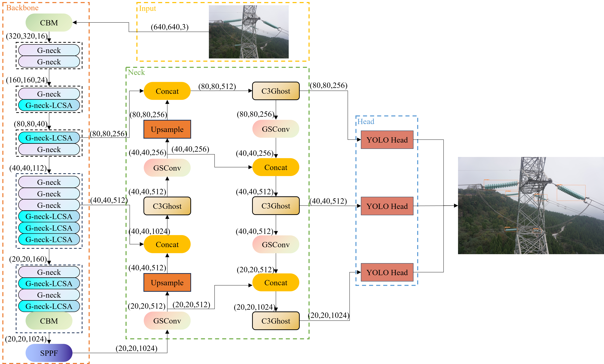
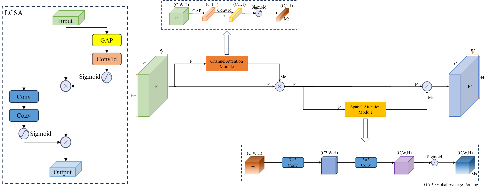
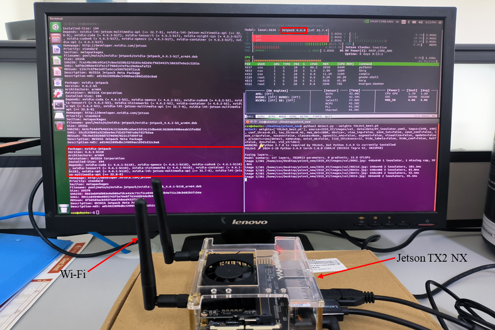

# A Lightweight Insulator Defect Detection Model Based on Drone Images

## Introduction
This is our PyTorch implementation of the paper "[`A Lightweight Insulator Defect Detection Model Based on Drone Images`](https://doi.org/10.3390/drones8090431)" published in ***Drones***.


## <div align="left">Quick Start Examples</div>

<details open>
<summary>Install</summary>

First, clone the project and configure the environment.
[**Python>=3.7.0**](https://www.python.org/), [**PyTorch>=1.7**](https://pytorch.org/get-started/locally/).

```bash
git clone https://github.com/LuYang-2023/Insulator-Defect-Detection-YOLO.git  # clone
cd Insulator-Defect-Detection-YOLO
pip install -r requirements.txt  # install
```
</details>

<details open>
<summary>Train</summary>


```python
python train.py --cfg models/IDD-YOLO.yaml --data data/mydata.yaml
```
</details>


<details>
<summary>Test</summary>


```bash
python val.py --data data/mydata.yaml --weights best.pt --task test
```
</details>


## 1.IDD-YOLO architecture diagram
<div align="center">
    
</div>

## 2.LCSA attention mechanism

<div align="center">
    
</div>


## 3.Experiment


**3.1 Edge Platform Deployment**
<div align="center">
    
</div>

### Citation
If you use this code or article in your research, please cite it using the following BibTeX entry:

```bibtex
@Article{drones8090431,
AUTHOR = {Lu, Yang and Li, Dahua and Li, Dong and Li, Xuan and Gao, Qiang and Yu, Xiao},
TITLE = {A Lightweight Insulator Defect Detection Model Based on Drone Images},
JOURNAL = {Drones},
VOLUME = {8},
YEAR = {2024},
NUMBER = {9},
ARTICLE-NUMBER = {431},
URL = {https://www.mdpi.com/2504-446X/8/9/431},
ISSN = {2504-446X},
DOI = {10.3390/drones8090431}
}
```


## Author's Contact
Email：yj20220275@stud.tjut.edu.cn


