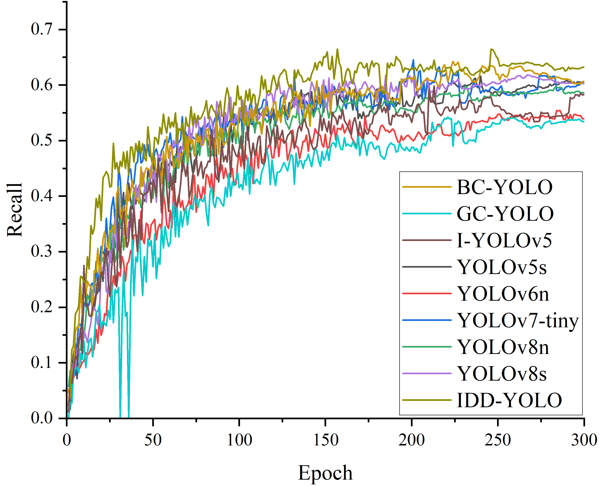
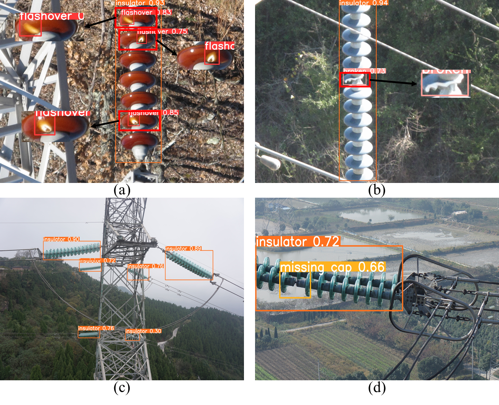

This code originates from a paper currently being submitted to the ***Remote Sensing*** journal, with the manuscript number ***remotesensing-3128054***. Upon publication, the code will be made publicly available. 

**During the review process, if reviewers wish to examine the code, they are welcome to contact me via email, and I will provide the necessary access permissions.**

## 1.IDD-YOLO architecture diagram
The structural diagram of the YOGL target detection model will be published after the acceptance of the paper.

## 2.LCSA attention mechanism
The structural diagram and rationale of the LCSA attention mechanism will be published after the acceptance of the paper.

## 3.Dataset
The full data set will be published later.

**3.1 Example image of ID-2024**

## 4.Experiment

**4.1 Comparative Experiments with Mainstream Attention Mechanisms**

**4.2 Comparison Experiment with Mainstream Lightweight Object Detection Algorithms**

**4.3 Edge Platform Deployment**

## 5 Insulator defect detection results

## Author's Contact
Email：yj20220275@stud.tjut.edu.cn

