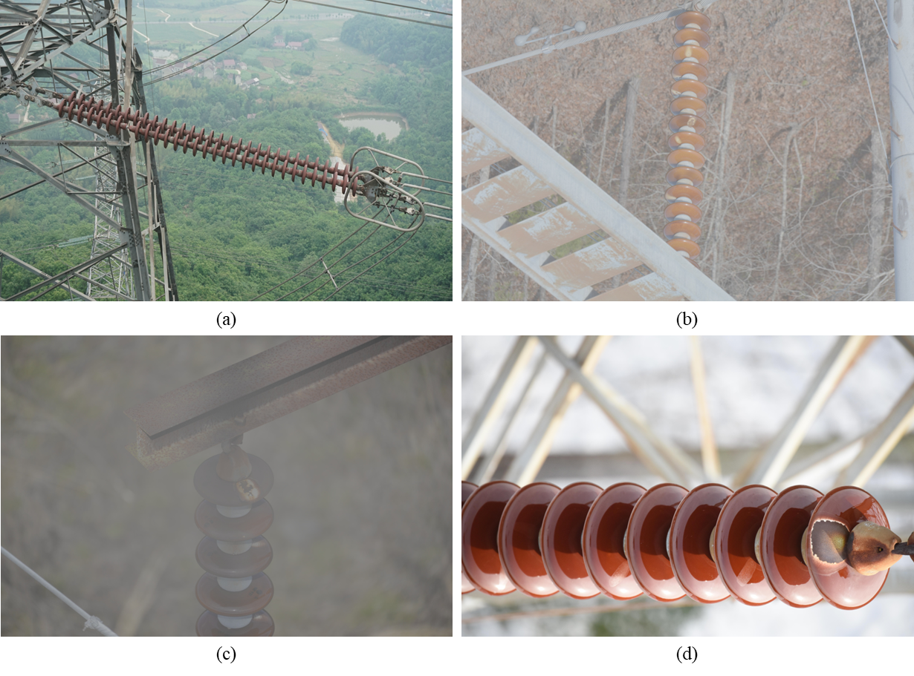
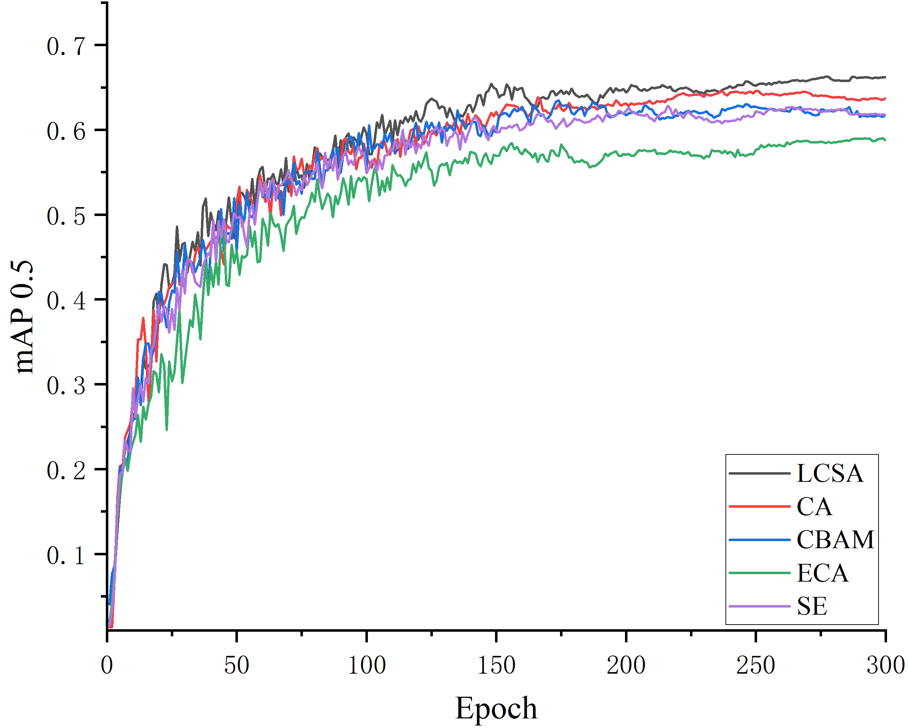
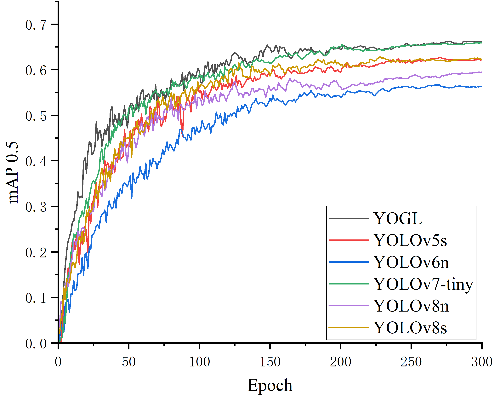
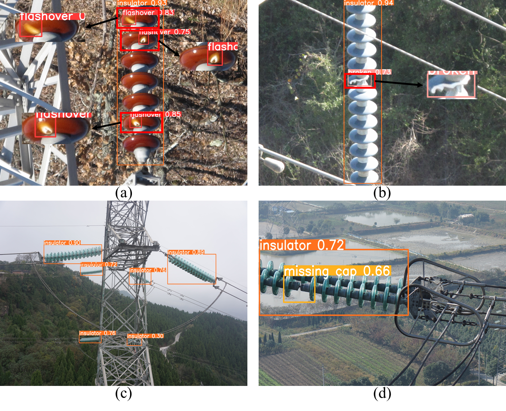

# YOGL: A Lightweight Insulator Defect Detection Network Based on UAV Remote Sensing Images

**Dear reviewers: The source code and pre-trained model weights will be available upon the acceptance of the paper.   Feel free to raise your questions or difficulties in the implementation.**

## YOGL architecture diagram
The structural diagram of the YOGL target detection model will be published after the acceptance of the paper.

## LCSA attention mechanism
The structural diagram and rationale of the LCSA attention mechanism will be published after the acceptance of the paper.

## Dataset
The full data set will be published later
1.**Example image of ID-2024**

## Experiment

1.**Comparative Experiments with Mainstream Attention Mechanisms**

2.**Comparison Experiment with Mainstream Lightweight Object Detection Algorithms**

3.**Edge Platform Deployment**

## Insulator defect detection results

## Author's Contact
Email：ly13063414159@163.com

